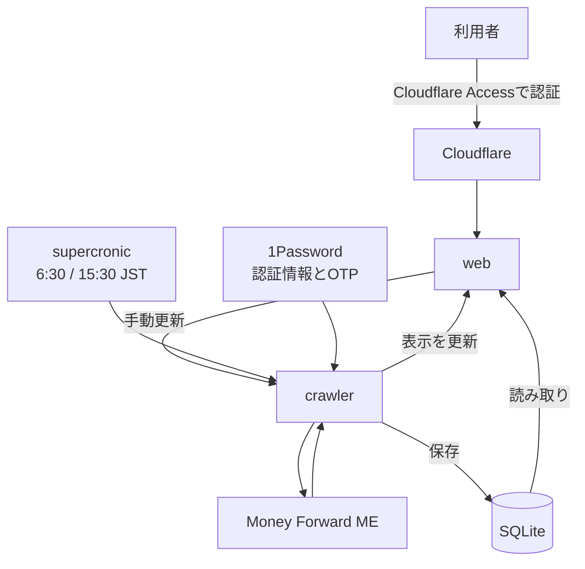

  
  <h1>MoneyForward Me Dashboard</h1>
  
Money Forward MEのデータ取得・更新・可視化を自動化するダッシュボード

Money Forward MEの家計・資産・投資データを定期的に取得し、Webダッシュボードで確認できる。更新結果の通知、取引カテゴリの自動決定、AIアシスタントからのデータ照会にも対応する。

[デモを見る](https://mf-dashboard-demo.vercel.app/) · [本番環境をセットアップする](docs/setup.md)

## 主な機能

### 金融機関の情報を自動更新

crawlerコンテナ内のsupercronicが、登録金融機関の「一括更新」を定期的に実行して完了を監視する。既定の実行時刻は毎日6:30と15:30。

### 更新結果をDiscordへ通知

通知先を設定すると、更新結果や前日との差分をDiscordへ投稿できる。Slackへは更新エラーとOTP入力待ちのアラートだけを通知する。

### 家計・資産情報を可視化

予算機能を除くダッシュボードの表示を、[公開デモ](https://mf-dashboard-demo.vercel.app/)で確認できる。

| 月次画面                                                                     | ダッシュボード                                                                             |
| ---------------------------------------------------------------------------- | ------------------------------------------------------------------------------------------ |
|  |  |

### スクレイピング処理をフックで拡張

スクレイピング中に独自のスクリプトを実行できる。MoneyForward Meでなにか処理を挟み込みたいときに利用する。

### 未分類取引のカテゴリを自動決定

`data/category-rules.json`を用意すると、新規の未分類取引へ固定ルールを適用できる。ルールに一致しない取引には、任意でLLMによる推論も利用できる。決定したカテゴリはMoneyForward MEへ反映し、対象月を再取得してデータベースへ保存する。

[カテゴリ決定機能を設定する](docs/setup.md#未分類取引のカテゴリ決定)

### AIによる財務インサイトと家計データ照会

インサイトページでは、取得した家計データをもとに、貯蓄の健全性、収支バランス、支出パターン、投資パフォーマンス、負債状況を分析する。財務健全性スコアや主要な指標に加えて、AIが生成した要約と各項目へのコメントをまとめて確認できる。

Webアプリ右下の家計AIチャットでは、「先月の食費はいくら？」「資産が前月からどのくらい増えた？」といった質問を自然言語で入力できる。選択中のグループに保存された家計・資産・投資データを参照し、回答に必要な集計や比較を行うため、画面を行き来せずに知りたい情報を調べられる。

| 財務インサイト                                                                     | 家計AIチャット                                                                  |
| ---------------------------------------------------------------------------------- | ------------------------------------------------------------------------------- |
|  |  |

### 複利シミュレーション

積立額や取崩額、年金などの条件を設定し、モンテカルロ法で資産推移をシミュレーションできる。[公開サイト](https://asset-melt.party/)でも利用可能。

## システム構成

Docker Composeで次の3サービスを動かす。

- **web**: SQLiteのデータを表示するNext.jsアプリ
- **crawler**: Money Forward MEからデータを取得し、SQLiteへ保存するPlaywrightアプリ
- **cloudflare**: Cloudflare Tunnelへ接続し、認証済みユーザーへWebアプリを公開

SQLiteはwebとcrawlerで共有する。外部アクセスはCloudflare TunnelとAccessで保護し、Googleログインとメールアドレスの許可リストを通過したユーザーだけに限定する。詳しい構築手順は[セットアップガイド](docs/setup.md)を参照。
